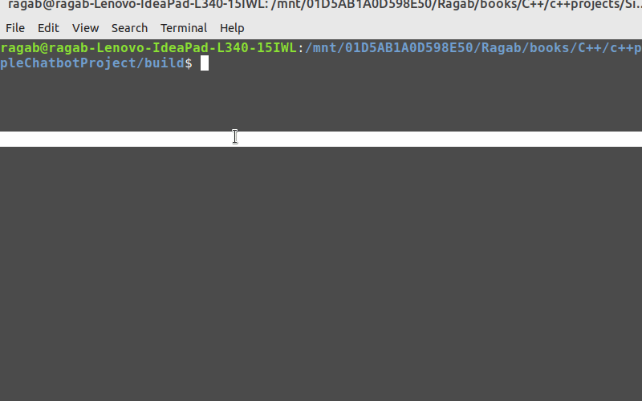

# Simple C++ Chatbot

## Description

A simple C++ chatbot project designed to engage in natural language conversations with users. The chatbot employs Natural Language Processing (NLP) techniques to understand user input, recognize user intents, and generate relevant responses. It manages conversation flows, handles errors, and provides clarifications as needed. The chatbot's responses are based on a knowledge base that can be updated and extended. The user interacts with the chatbot through a text-based Command-Line Interface (CLI) for a seamless conversational experience.

## Technology

- **Programming Language:** C++
- **Integrated Development Environment (IDE):** Visual Studio Code (VSCode)
- **Command-Line Interface (CLI):** Used for user interaction
- **Natural Language Processing (NLP):** Implementing NLP techniques for understanding and generating text-based responses
- **Libraries for Time-Related Operations:** Depending on the chatbot's functionalities, libraries for time-related operations may be used for scheduling and handling time-based tasks.
- **Data Structures:** Utilized for managing conversation context, user input, and responses.
- **Knowledge Base:** A data source that contains information used to generate responses.
- **File System Interaction:** Optionally, the project could implement file system interaction for saving and loading knowledge base or chat history to provide persistence and learning capabilities for the chatbot.

## Getting Started

- Clone the repository.
- Compile and build the project using your C++ compiler.
- Run the chatbot application in the command-line interface.
- Start chatting with the chatbot.

## Usage

Provide instructions on how to interact with the chatbot and any specific commands or features it supports.

## Contributing

If you'd like to contribute to this project, please follow the guidelines in [CONTRIBUTING.md](CONTRIBUTING.md).

## License

This project is licensed under the [MIT License](LICENSE).

## Acknowledgments

Mention any external libraries, resources, or inspirations you used or found helpful during the project development.

---

**Note:** The above sections are placeholders. Make sure to replace the GIF link with your own chatbot demo GIF and add detailed information about your project as needed.
